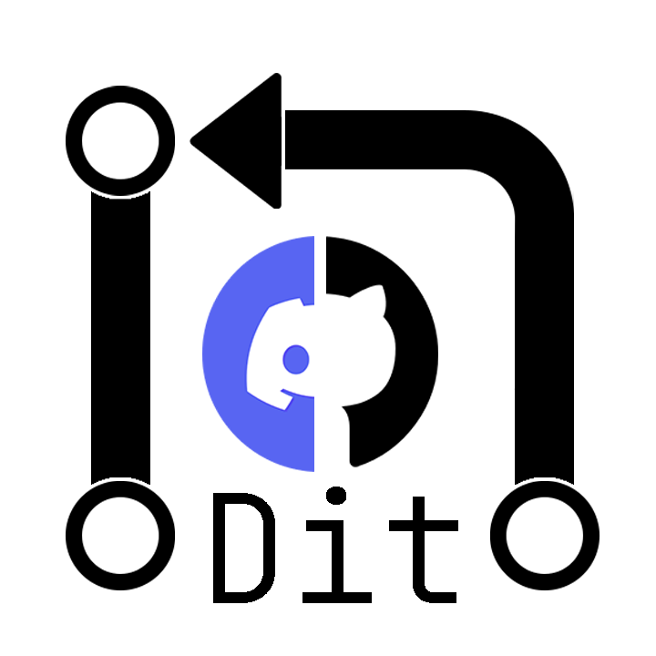

<div align="center" id="top"> 
  

  &#xa0;

  <!-- <a href="https://botdiscordgithub.netlify.app">Demo</a> -->
</div>

<h1 align="center">Bot Dit</h1>

<p align="center">
  

  

  

  

  <!--  -->

  <!--  -->

  
</p>

<!-- Status -->

<h4 align="center"> 
	🚧  Bot Dit 🚀 Under construction...  🚧
</h4> 

<hr> 

<p align="center">
  <a href="#dart-about">About</a> &#xa0; | &#xa0; 
  <a href="#sparkles-features">Features</a> &#xa0; | &#xa0;
  <a href="#rocket-technologies">Technologies</a> &#xa0; | &#xa0;
  <a href="#white_check_mark-requirements">Requirements</a> &#xa0; | &#xa0;
  <a href="#checkered_flag-starting">Starting</a> &#xa0; | &#xa0;
  <a href="#memo-license">License</a> &#xa0; | &#xa0;
  <a href="https://github.com/{{YOUR_GITHUB_USERNAME}}" target="_blank">Author</a>
</p>

<br>

## :dart: About ##

A bot for you and your team to have a little more automation in PR reviewers.
The bot's job is to let everyone involved in the PR know what is happening, for example: when the PR is open, all reviewers are notified by receiving a private message in discord, and at the same time it is notified to the rest of the staff at team that a new PR was created and who are the people involved, such as the assigners and reviewers.
RP designators are also notified when a reviewer makes a change request and reviewers are notified again after a new reviewer request.

**I recommend that everyone is on the same discord server for a better use of the Bot**

## :sparkles: Features ##

:heavy_check_mark: Message open/close of pull requests;\
:heavy_check_mark: Send messages private to reviewers/assignees ;\
:heavy_check_mark: Send messages private to assignees in status approved/changes_requested/comments ;
<!-- :heavy_check_mark: Feature 3; -->

## :rocket: Technologies ##

The following tools were used in this project:

- [Node.js](https://nodejs.org/en/)
- [Express](https://expressjs.com/pt-br/)
- [Discord.js](https://discord.js.org/#/)

## :white_check_mark: Requirements ##

Before starting :checkered_flag:, you need to have [Git](https://git-scm.com) and [Node](https://nodejs.org/en/) installed.

## :seedling: Example .env

```.env
TOKEN_BOT = "BOT_DISCORD_TOKEN"
CHANNEL_ID = "CHANNEL_ID_OF_SERVER"
```

## :checkered_flag: Starting ##

```bash
# Clone this project
$ git clone https://github.com/EmanuelFacundo/bot-discord-github

# Access
$ cd bot-discord-github

# Install dependencies
$ npm i

# Run the project
$ npm start

# The server will initialize in the <http://localhost:3000>
```

## :memo: License ##

This project is under license from MIT. For more details, see the [LICENSE](LICENSE.md) file.


Made with :heart: by <a href="https://github.com/EmanuelFacundo" target="_blank">Emanuel Facundo</a>

&#xa0;

<a href="#top">Back to top</a>
